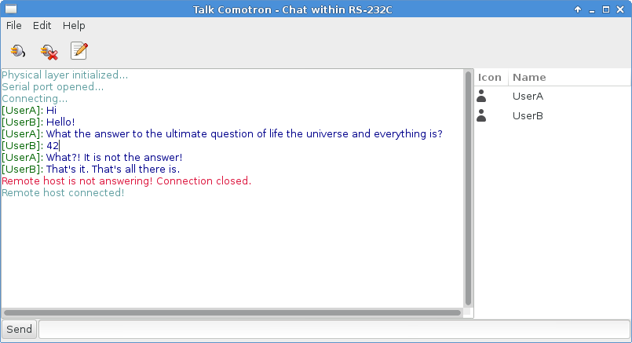

PowerCom
========

Serial port chat to train Haskell. Application based on [Gtk2Hs](http://projects.haskell.org/gtk2hs/) 
and [Cloud Haskell](haskell-distributed.github.io).

Compilation
===========

1. Install Gtk2Hs from [this tutorial](http://www.haskell.org/haskellwiki/Gtk2Hs/Installation).
2. Install [network-transport-inmemory](https://github.com/haskell-distributed/network-transport-inmemory) package 
that not presented in hackage.

And finally in PowerCom root directory:
```
cabal install
```

Features
========

1. Serial port detection (linux only now);
2. Colorfull chat;
3. Logical connection with remote connection;
4. Uplink checker;
5. Option changing on the fly on both sides;
6. Sending very large texts;
7. Frame protection with cyclic code and send retries;
8. History saving/loading;
9. Username changing on the fly;

Testing with serial port
========================

You should have two serial ports linked to each other (com0com on Windows, socat in linux or [tty0tty](https://github.com/freemed/tty0tty)). For instance, one user for 'COM1' and second for 'COM2'. On posix you can use socat to create serial port pipe:
```
socat PTY,link=ttyS1 PTY,link=ttyS2
```

Screenshots
===========


